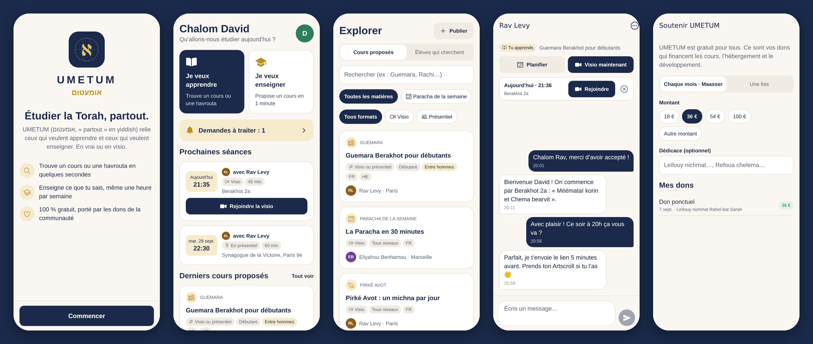
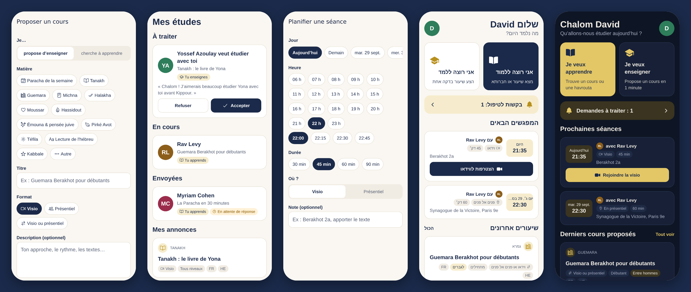

# UMETUM · אומעטום

**La Torah, partout.** *Umetum* veut dire « partout » en yiddish.

UMETUM met en relation les personnes qui veulent **étudier la Torah** et celles qui veulent **l'enseigner**, en présentiel ou en visio. Tout le monde peut être élève, enseignant, ou les deux.
L'app est **gratuite**. Elle vit grâce aux **dons**, ponctuels ou mensuels : *« donne ton maasser en t'abonnant »*, du montant de ton choix.




## Fonctionnalités (v0.1)

| | |
|---|---|
| **Connexion sans mot de passe** | Un code à 6 chiffres est envoyé par e-mail. |
| **Onboarding en 3 étapes** | Prénom, langues, ville, puis « apprendre / enseigner / les deux ». |
| **Annonces** | « Je propose un cours » ou « Je cherche un cours », publiées en une minute : matière, format (visio / présentiel), niveau, public (tout public, entre hommes, entre femmes), langues, disponibilités. |
| **Explorer** | Cours proposés et élèves qui cherchent, avec recherche et filtres par matière et par format. Les annonces réservées à l'autre public sont masquées automatiquement. |
| **Mise en relation** | Un bouton pour faire une demande, un autre pour accepter ou refuser. Le rôle (enseignant ou élève) est déduit de l'annonce. |
| **Chat en temps réel** | Il s'ouvre dès que la demande est acceptée. |
| **Séances** | Planification en 3 touches (jour, heure, durée), en visio ou en présentiel. Pas de séance proposée le Chabbat. |
| **Visio intégrée** | LiveKit, en natif sur iOS et Android et dans le navigateur. Bouton « Visio maintenant » pour lancer un appel tout de suite. |
| **Dons** | Maasser mensuel au montant libre ou don ponctuel, avec dédicace (*leïlouy nichmat*, *refoua chelema*…), paiement Stripe, portail pour gérer ou arrêter l'abonnement, historique des dons. |
| **Sécurité** | Signalement d'une annonce ou d'un profil, suppression du compte depuis l'app, règles d'accès en base (RLS). |
| **Langues** | Français, anglais, hébreu (de droite à gauche), mode clair et mode sombre. |

## Stack technique

| Couche | Choix | Pourquoi |
|---|---|---|
| App | **Expo SDK 57 + React Native 0.86 + TypeScript** | Une seule base de code pour iOS, Android et le web. Builds et publication sur les stores via EAS, mises à jour à distance (OTA). |
| Navigation | **Expo Router** (routes = fichiers) | Ajouter un écran revient à ajouter un fichier. Liens profonds gérés sans configuration. |
| Données | **TanStack Query** | Cache, rafraîchissement, pagination infinie, mode hors-ligne progressif. |
| Backend | **Supabase** (Postgres, Auth, Realtime, Storage, Edge Functions) | Postgres avec des règles d'accès par ligne (RLS), temps réel, rien à héberger soi-même au départ. |
| Visio | **LiveKit** (Cloud ou auto-hébergé) | Open source et scalable, SDK natifs React Native et web. |
| Paiements | **Stripe Checkout + Customer Portal** | Montants libres, abonnements, Apple Pay et Google Pay, reçus, portail client. |
| i18n | **i18next** | Clés typées, français, anglais et hébreu (RTL). |

## Démarrer en local

```bash
npm install
cp .env.example .env.local        # puis remplir les valeurs (voir docs/SETUP.md)
npm run web                       # aperçu immédiat dans le navigateur
npm run ios / npm run android     # build de développement (nécessaire pour la visio native)
```

Sans backend configuré, l'app affiche un écran « Configuration requise ».
Le guide complet de mise en production (Supabase, LiveKit, Stripe, stores) est dans **[docs/SETUP.md](docs/SETUP.md)**.

## Qualité

```bash
npm run typecheck                 # TypeScript strict (types de la base inclus)
npm run lint                      # ESLint (règles React Compiler)
./scripts/test-db.sh              # migrations + règles RLS sur un Postgres de test
deno check supabase/functions/*/index.ts
```

La CI GitHub (`.github/workflows/ci.yml`) lance ces quatre vérifications à chaque push.

## Structure

```
src/
  app/            écrans (Expo Router) : un fichier = une route
  features/       logique métier par domaine (auth, listings, connections, chat, sessions, video, donations…)
  ui/             composants réutilisables (Button, Card, Chip, TextField…)
  i18n/           traductions fr / en / he
  theme/          couleurs, espacements, typographie
  lib/            client Supabase, formats, utilitaires
  types/          types de la base de données
supabase/
  migrations/     schéma SQL + règles RLS
  functions/      Edge Functions (jeton visio, Stripe, suppression de compte)
  tests/          tests SQL des règles de sécurité
docs/             SETUP, ARCHITECTURE, ROADMAP
```

Pour aller plus loin : **[docs/ARCHITECTURE.md](docs/ARCHITECTURE.md)** (modèle de données, sécurité, comment ajouter une fonctionnalité) et **[docs/ROADMAP.md](docs/ROADMAP.md)** (les prochaines étapes).
