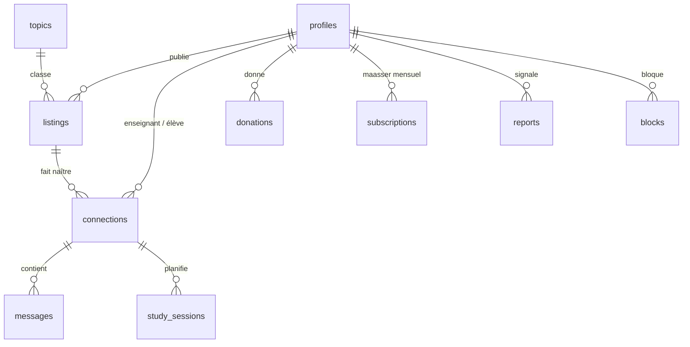

# Architecture

## Vue d'ensemble

```
┌──────────────────────────────┐        ┌───────────────────────────────────────────┐
│  App Expo (iOS/Android/Web)  │        │                 Supabase                  │
│                              │  HTTPS │  Postgres + RLS  (tables, règles d'accès) │
│  Expo Router  (écrans)       │───────▶│  Auth            (code e-mail)            │
│  TanStack Query (cache)      │  WSS   │  Realtime        (chat, statuts)          │
│  supabase-js                 │◀──────▶│  Storage         (photos de profil)       │
│                              │        │  Edge Functions  (Deno)                   │
└──────┬───────────────┬───────┘        └──────┬───────────────────────┬────────────┘
       │ WebRTC        │ navigateur            │ jeton                 │ API + webhook
       ▼               ▼                       ▼                       ▼
  ┌──────────┐   ┌──────────────┐        ┌──────────┐            ┌──────────┐
  │ LiveKit  │   │ Stripe       │        │ LiveKit  │            │  Stripe  │
  │ (visio)  │   │ Checkout     │        │ (clés)   │            │          │
  └──────────┘   └──────────────┘        └──────────┘            └──────────┘
```

**Principe :** l'app lit et écrit directement dans Postgres via supabase-js. La **sécurité est dans la base** : des règles RLS définissent qui voit et modifie quoi. Seules les opérations qui demandent un secret (jeton LiveKit, Stripe, suppression de compte) passent par des Edge Functions.

## Modèle de données



| Table | Contenu |
|---|---|
| `profiles` | Un profil par compte, créé automatiquement à l'inscription. Tout le monde peut apprendre et enseigner (`wants_to_learn`, `wants_to_teach`). |
| `topics` | Matières (Guemara, Halakha…). Ajouter une ligne suffit à faire apparaître une matière, sans mise à jour de l'app. |
| `listings` | Annonces : `kind = offer` (je propose un cours) ou `request` (je cherche un cours). |
| `connections` | Mise en relation entre un `teacher_id` et un `student_id`, statut `pending → accepted / declined / cancelled`. |
| `messages` | Chat d'une mise en relation acceptée, en temps réel. |
| `study_sessions` | Séances (visio ou présentiel). `room_name` identifie la salle LiveKit. |
| `donations`, `subscriptions`, `stripe_customers` | Dons, écrits uniquement par le webhook Stripe. |
| `reports`, `blocks` | Signalements et blocages. |

## Sécurité (RLS)

- Un membre ne voit que ses propres mises en relation, messages et séances. `is_connection_member()` et `is_connection_active()` servent dans les règles.
- Le chat et la planification de séances ne s'ouvrent **qu'après acceptation**.
- Les mises en relation ne s'écrivent pas directement. Elles passent par deux fonctions SQL : `request_connection()`, qui déduit qui enseigne et qui apprend, et `respond_connection()` (accepter, refuser, annuler, avec les bonnes permissions).
- Les dons ne peuvent pas être écrits depuis l'app, seulement par le webhook Stripe signé.
- Le blocage masque les annonces dans les deux sens et termine les échanges en cours.
- Tout cela est vérifié par `supabase/tests/rls_test.sql` (`./scripts/test-db.sh`).

## Parcours principaux

**Mise en relation**
1. A publie une annonce « je propose Guemara ».
2. B appuie sur « Demander à étudier ensemble ». `request_connection` crée une demande `pending` avec A comme enseignant et B comme élève.
3. A voit la demande en temps réel (badge sur l'onglet *Mes études*) et accepte.
4. Le chat s'ouvre. Ils planifient une séance ou lancent « Visio maintenant ».

**Visio**
1. L'app appelle `livekit-token` avec l'id de la séance.
2. La fonction vérifie, avec les droits de l'utilisateur (RLS), qu'il est bien participant et que l'horaire est dans la fenêtre prévue, puis signe un jeton pour la salle `room_name`.
3. L'app rejoint la salle : SDK natif LiveKit sur mobile, composant web sur navigateur. Le module vidéo n'est chargé qu'à ce moment-là.

**Dons**
1. `create-checkout` crée une session Stripe Checkout (montant libre, mensuel ou ponctuel) et renvoie son URL.
2. L'app ouvre l'URL : Safari sur iOS (règle App Store), navigateur intégré sur Android, même onglet sur le web.
3. Stripe appelle `stripe-webhook`, qui enregistre le don ou l'abonnement. L'app rafraîchit l'historique au retour.

## Organisation du code

```
src/app/            Écrans. Chaque fichier est une route (Expo Router).
src/features/<x>/   Un dossier par domaine métier :
                      api.ts        requêtes Supabase + hooks React Query
                      *Card.tsx     composants propres au domaine
src/ui/             Composants génériques, sans logique métier.
src/theme/          Jetons de design (couleurs clair/sombre, espacements, typographie).
src/i18n/locales/   fr.ts est la référence ; en.ts et he.ts doivent avoir les mêmes clés (vérifié par TypeScript).
src/types/          Types de la base, miroir des migrations.
```

**Règles**
- Les écrans (`src/app`) restent fins : ils assemblent des hooks de `features/` et des composants de `ui/`.
- Pas de texte en dur : tout passe par `t('...')`. Les clés sont typées, une clé manquante est une erreur de compilation.
- Pas de couleur en dur : `useTheme().colors`.
- Les requêtes passent par React Query, avec des clés de cache centralisées dans chaque `api.ts`.

## Ajouter une fonctionnalité (exemple : « avis après une séance »)

1. **Base** : nouvelle migration `supabase/migrations/<date>_reviews.sql` (table, index, RLS), puis `npx supabase db push`.
2. **Tests** : ajouter les scénarios de sécurité dans `supabase/tests/rls_test.sql`.
3. **Types** : ajouter la table dans `src/types/database.ts`. Avec un Supabase local, `npm run db:types` génère la version officielle dans `database.gen.ts`, utile pour comparer.
4. **Logique** : `src/features/reviews/api.ts` (hooks `useReviews`, `useCreateReview`).
5. **Écran** : `src/app/review/[sessionId].tsx`, et le déclarer dans `src/app/_layout.tsx`, dans le bloc `Stack.Protected` des membres connectés.
6. **Textes** : clés dans `fr.ts`, `en.ts` et `he.ts`.
7. **Vérifier** : `npm run typecheck && npm run lint && ./scripts/test-db.sh`.

## Montée en charge

- Postgres : index en place sur tous les chemins chauds (fil d'annonces, conversations, séances). Le fil est paginé par 20.
- Realtime : abonnements filtrés par conversation. Seuls les événements autorisés par la RLS sont diffusés.
- Visio : LiveKit Cloud passe à l'échelle automatiquement, ou on auto-héberge le serveur open source.
- Fonctions : sans état, elles montent en charge automatiquement.
- Au-delà de quelques dizaines de milliers d'utilisateurs actifs : recherche plein texte (`tsvector`), recherche géographique (PostGIS), mise en cache du fil d'accueil.
